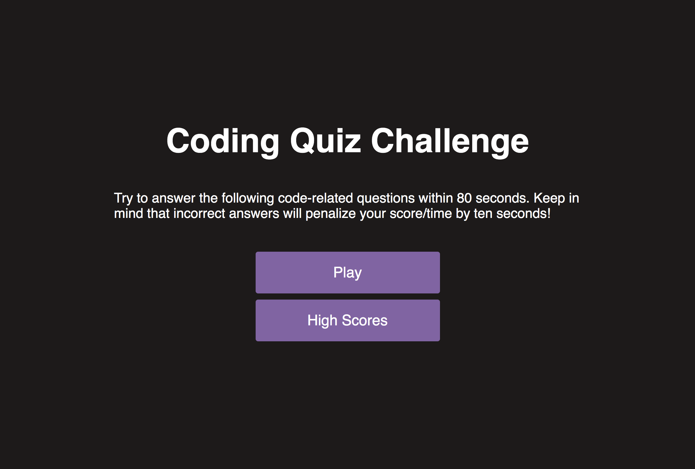
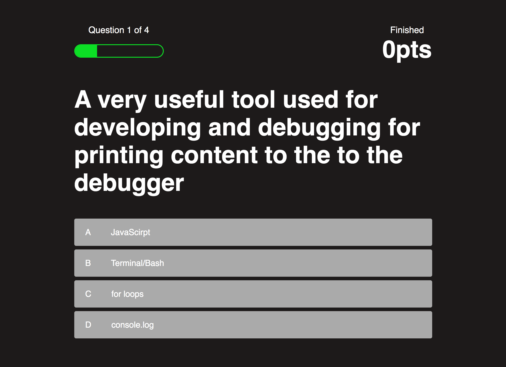

# Code Quiz

  ## Desciption 
  This program uses Javascript CSS and HTML to make a quiz.
  The user is prompted with a series of questions to answer in a allocated amount of time. When the user answers a question incorrectly no points are earned and 10   seconds is deducted.
  The project has been has been published to GitHub pages listed below.

  ## Table of Contents
  - [Usage](#usage)
  - [Questions](#questions)

  ## Usage 
  Open the depolyed appilcation and run through the quiz. 

  ## Questions 
  If you have any questions reach out to me at:  
  Github: https://github.com/Landonwilson1  
  Email: Landonjwilson1@gmail.com
u may obtain a copy of the License at

